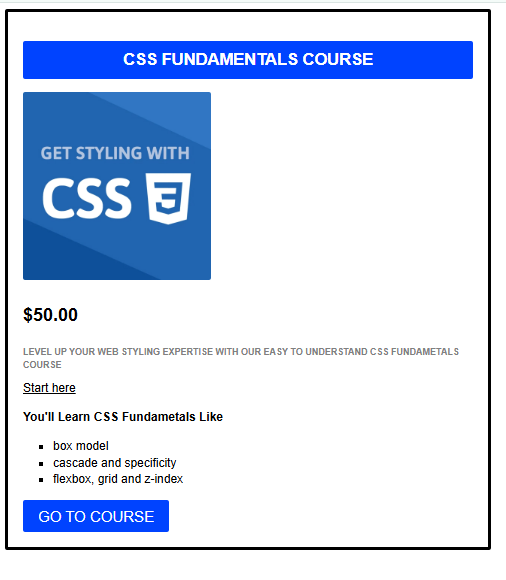

# 🚀 CSS Course Card Component


## 🌟 Overview

Welcome to my coding journey! I am currently transitioning into a **Full Stack Developer**. This repository showcases my progress in mastering Frontend fundamentals, specifically focusing on layout design and typography.

This project is a responsive **Product Card** designed for an online course platform. It demonstrates the clean structure of HTML combined with modern CSS styling techniques.

---

## 📸 Project Preview



---

## 🛠️ Tech Stack & Concepts Learned

During this build, I focused on the following core concepts:

* **Semantic HTML5:** Structuring content logically.
* **CSS Box Model:** Understanding padding, margins, and borders.
* **Flexbox:** Used for aligning the price and descriptions efficiently.
* **Typography:** Creating visual hierarchy (Headings vs. Body text).
* **Button Styling:** Creating interactive call-to-action buttons.

---

## 🚀 How to Run

Since this is a static web component, you can view it by:

1.  Cloning the repository:
    ```bash
    git clone [https://github.com/YOUR-USERNAME/css-course-card.git](https://github.com/YOUR-USERNAME/css-course-card.git)
    ```
2.  Opening `index.html` in your browser.

---

## 🔮 Future Improvements (The Roadmap)

As I move towards Backend development, I plan to upgrade this project by:
- [ ] Adding JavaScript to make the "Go to Course" button interactive.
- [ ] Connecting this card to a **Database** to fetch course details dynamically.
- [ ] Creating a backend API using **Node.js/Python**.

---

## 🤝 Connect With Me

I am open to feedback and collaboration as I continue my path to becoming a Full Stack Developer!

[My GitHub Profile](https://github.com/eissamo7ammed)
